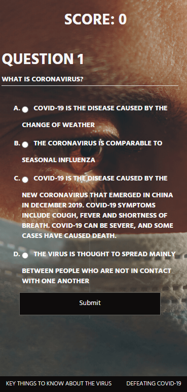

## COVID-19 Quizapp

A short quiz to test your knowledge about the infectious disease Coronavirus (COVID-19).




### Technologies used
- HTML5
- CSS3
- Vanilla JavaScript
- JQuery

### Interactive Web apps - Quiz app

#### User experience requirements

1. The starting screen should have a button that users can click to start the quiz.
2. Users should be prompted through a series of at least 5 multiple choice questions that they can answer.
3. Users should be asked questions 1 after the other.
4. Users should only be prompted with 1 question at a time.
5. Users should not be able to skip questions.
6. Users should also be able to see which question they're on (for instance, "7 out of 10") and their current score ("5 correct, 2 incorrect").
7. Upon submitting an answer, users should:
- receive textual feedback about their answer. If they were incorrect, they should be told the correct answer.
- be moved onto the next question (or interact with an element to move on).
8. Users should be shown their overall score at the end of the quiz. In other words, how many questions they got right out of the total questions asked.
9. Users should be able to start a new quiz.

#### Technical requirements

1. Render answer choices in a ```<form>```.
2. Use semantic HTML, along with CSS and jQuery.
3. Follow a11y best practices.
4. Refer back to the checkpoints on accessibility and forms for help.
5. Use responsive design.
6. Be fully usable by keyboard (which will be easy enough if you start with a form).

#### Process requirements
1. Before you dive into the app, you'll need to:

- gather content for your app. That means typing up the questions you'll ask and gathering any images or icons you'll need.
- think about the user experiences outlined above and how your design must make them possible.
- design your app using HTML wireframes, which are HTML- (and minimal CSS-) only versions of the different screens in your app.


